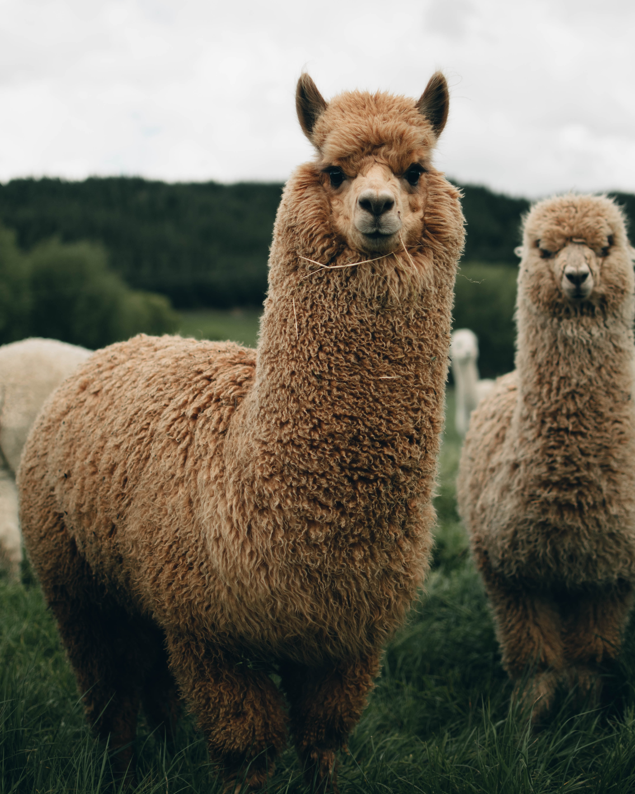

# LLama2_Fine_Tuning_Qlora

Finetune Llama-2-7b on a Google colab for french language and turn it into a chatbot.

We will leverage PEFT library from Hugging Face ecosystem, as well as QLoRA for more memory efficient finetuning Setup.

In June 2021, Hu et al. (2021) introduced low-rank adapters (LoRa) for LLMs.

LoRa adds a tiny amount of trainable parameters, i.e., adapters, for each layer of the LLM and freezes all the original parameters. For fine-tuning, we only have to update the adapter weights which significantly reduces the memory footprint.

QLoRa goes three steps further by introducing: 4-bit quantization, double quantization, and the exploitation of nVidia unified memory for paging.

Thanks to QLoRa, we can fine-tune models with billion parameters without relying on cloud computing and without a significant drop in performance.

